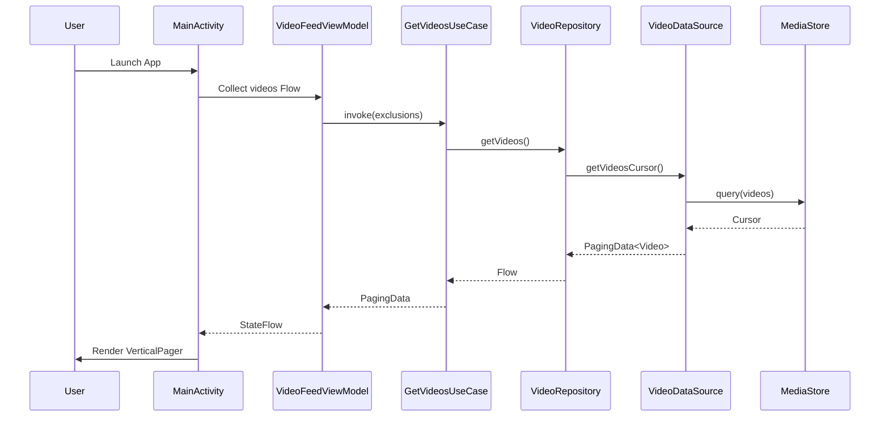
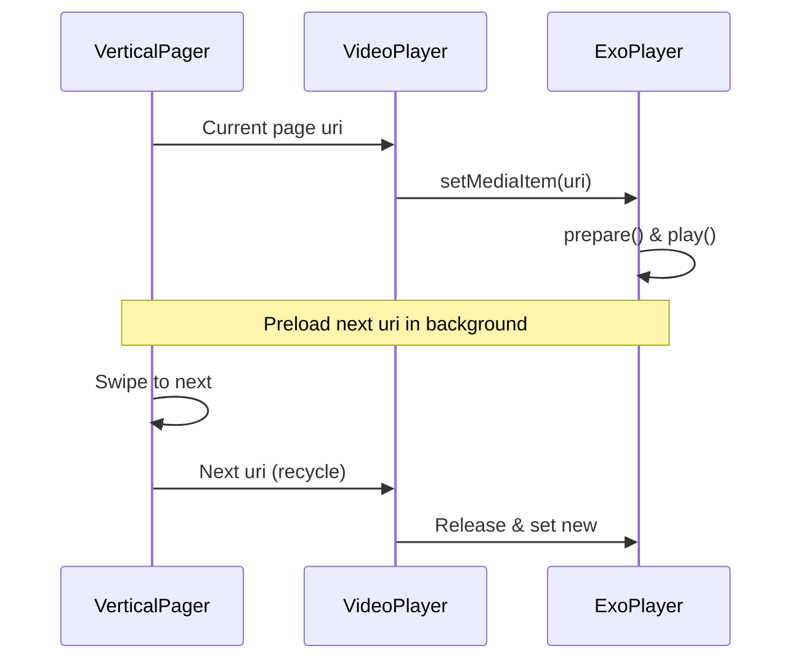
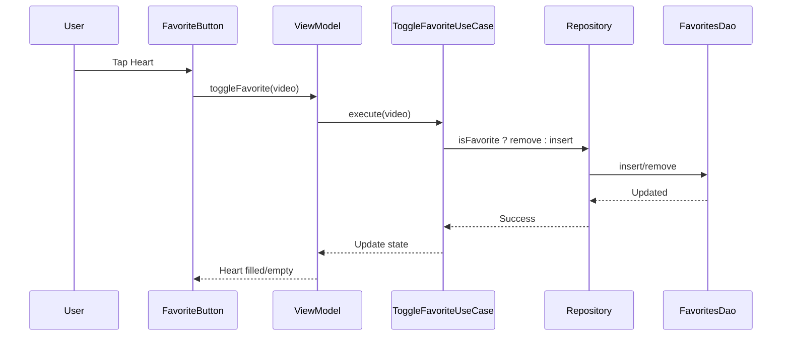
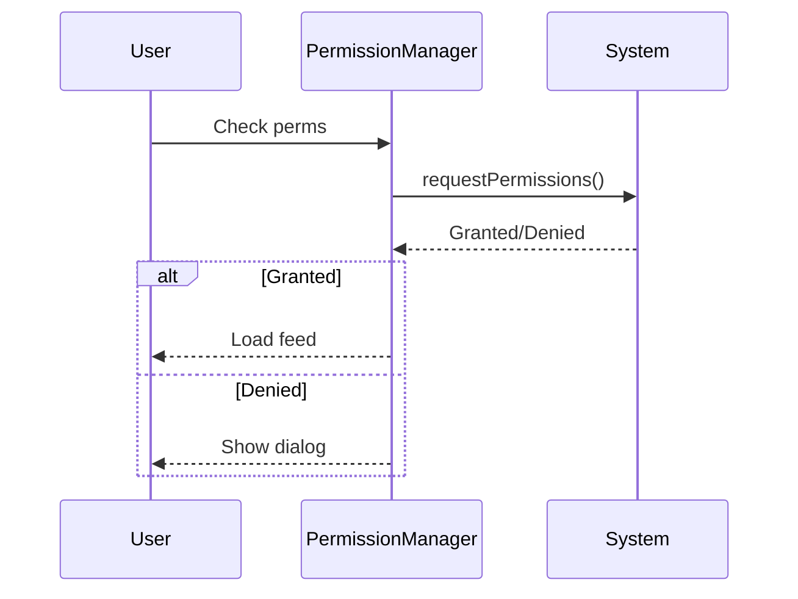
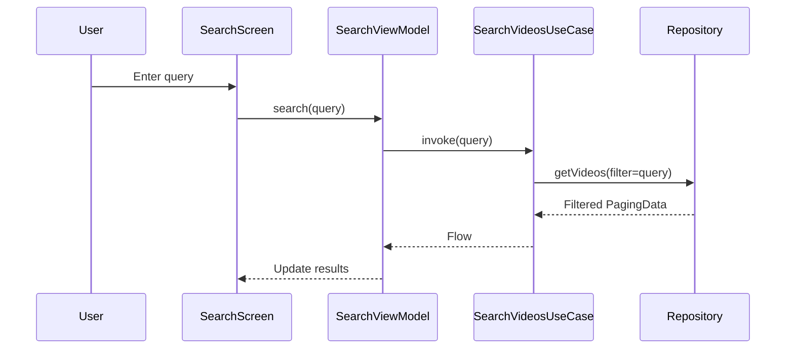

# memoREELS - Sequence Diagrams (Mermaid Syntax)

Render these in Mermaid Live or VSCode extension.

## 1. App Launch & Feed Load (Phase 1 MVP)

## 2. Video Playback & Preload

## 3. Toggle Favorite

## 4. Permission Request

## 5. Search Videos

These diagrams map to HLD data flows and LLD classes. Cover PRD core reqs.
